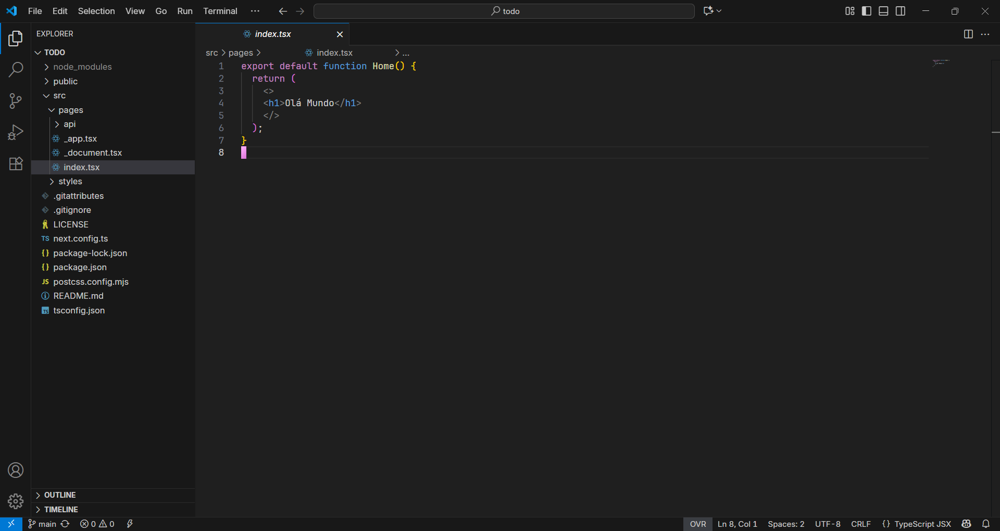

  <h1 align="center">Minimalist VSCode</h1>

## Before:

    
## After:

## About:

The VSCode Clean project was created to make your VSCode more powerful and focused by hiding unnecessary visual elements and creating a cleaner interface. Everything remains accessible via keyboard shortcuts, and I'll be providing some for easier use.

## Plugins:

- **Custom UI Style:** Custom UI Style is a VSCode extension that allows you to customize the editor's appearance and behavior by injecting custom CSS and JavaScript.

- **Symbols:** These are the icons for your VSCode.

- **Min Theme:** This theme enables the nice color scheme shown.

- **Prettier - Code Formatter:** This ensures consistent style in your code formatting.

## Font vscode

To type my code, I use the [JetBrains Mono Download](https://www.jetbrains.com/lp/mono/), which offers excellent readability and was developed specifically for programming. For VSCode's visuals, I use the [Dank Mono Download](https://github.com/saifulapm/my-fonts/tree/main/Dank%20Mono), which brings a more modern and elegant style to the interface.

## JSON Settings:

Now, press:

- For Mac:
  `⌘` + `Shift` + `P`
- For Windows:
  `Ctrl` + `Shift` + `P`

And click on Preferences: Open User Settings. In the User tab, find > Extensions, open it, and click on APC. Once there, click on any Edit in settings.json.

After opening `settings.json`, copy and paste this JSON: [HERE](https://github.com/OctavioDelpupo/minimalist-VSCode/blob/main/settings.json), restart your VSCode and it should good to go.

## 📝 License

[MIT](https://github.com/OctavioDelpupo/minimalist-VSCode) licensed.

---